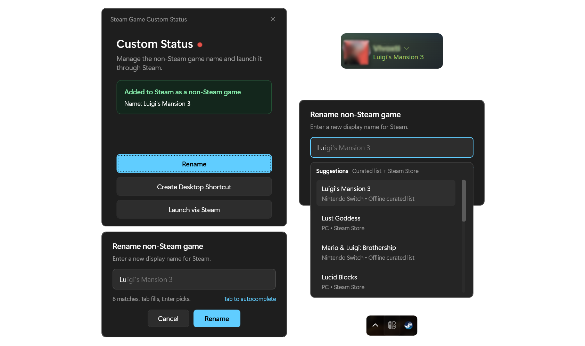

# Steam Game Custom Status

Minimal tray-first Windows app for people who run it through Steam as a `non-Steam game` and want quick control over the title Steam shows for the **current executable path**.

It stays out of the way, lives in the system tray, shows whether the current build is registered in Steam, and lets you rename the matching shortcut without digging through `shortcuts.vdf` manually.



_Compact main window for Steam status, rename, and quick actions._

## Highlights

- **Tray-first by design** — starts in the tray and closing the window hides it back there
- **Path-based matching** — only touches the Steam shortcut whose `Exe` matches the current running `.exe`
- **Steam-aware status** — shows the current Steam name plus Active / Inactive state
- **Safe rename flow** — creates `shortcuts.vdf.bak` before saving changes
- **Useful launch actions** — supports `Launch via Steam` and desktop shortcuts via `steam://rungameid/...`
- **Compact rename UX** — manual naming stays primary, with offline + online suggestions when available

## Typical flow

1. Publish the app.
2. Add the published executable to Steam as a **non-Steam game**.
3. Launch it from Steam when you want Steam presence integration.
4. Use the tray menu or compact window to rename the entry, create a desktop shortcut, or relaunch through Steam.

If the app is not registered yet, it can open Steam to the add-game flow and also shows the current executable path for manual selection.

## What to expect

- The tray icon mirrors Steam activity: **white** while active, **gray** while inactive.
- If the shortcut exists but the app was started outside Steam, `Launch via Steam` becomes available.
- After rename, the app can restart Steam safely when immediate apply is possible.
- Only the published executable path should be added to Steam; debug builds or copies from other folders will not match.
- Single-instance behavior prefers the Steam-launched instance when needed.

## Build and publish

Canonical executable build:

```powershell
dotnet publish -c Release
```

Published executable:

```text
bin\Release\net10.0-windows\win-x64\publish\SteamGameCustomStatus.exe
```

## Stack

- `.NET 10`
- `WPF`
- `Windows Forms NotifyIcon`

## More context

Detailed runtime behavior, safety boundaries, and release verification notes live in [`docs/project-context.md`](./docs/project-context.md).

